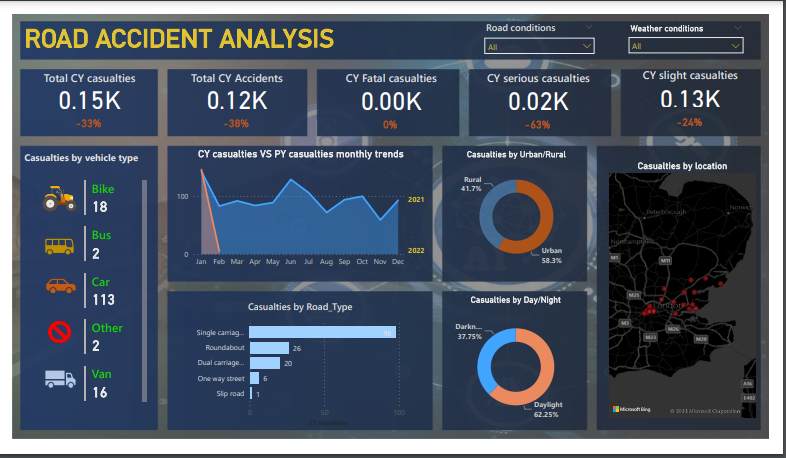

# 🚧 Road Accident Analysis Dashboard  

 <!-- Replace with actual screenshot path -->

---

## 📝 Project Overview  
This Power BI project analyzes road accident data from the UK to identify patterns and risk factors.  
The dashboard provides insights into:  

- Accident **frequency by month and year**  
- **Severity levels** of accidents  
- Impact of **lighting, surface, and road conditions**  
- Breakdown by **vehicle type** and **region**  

The goal is to support better traffic safety decisions and interventions.  

---

## 📁 Dataset  
- **Source:** UK Road Accident Records  
- **Time Range:** 2021–2022  
- **Key Columns:**  
  - Date & Time  
  - Number of Casualties  
  - Vehicle Type  
  - Road Type & Surface Condition  
  - Lighting Condition  
  - Police Force Region  

---

## 🔧 Tools & Technologies  
- **Power BI** – Data cleaning, modeling, DAX measures, and visualization  
- **SQL / Excel** – Pre-processing and validation  

---

## 🚀 Features & Insights  
- ✅ Interactive dashboards with **drill-through and slicers**  
- ✅ KPIs tracking **casualties, severity rates, and accident trends**  
- ✅ Visuals showing the effect of **lighting, road surface, and vehicle type**  
- ✅ Monthly and yearly accident distribution charts  

---

## 📊 Dashboard Pages  
1. **Overview Dashboard** – High-level KPIs and trend charts  
2. **Accident Severity** – Breakdown of casualties by severity levels  
3. **Conditions Analysis** – Lighting, road, and surface conditions  
4. **Vehicle Insights** – Accident patterns by vehicle type  

